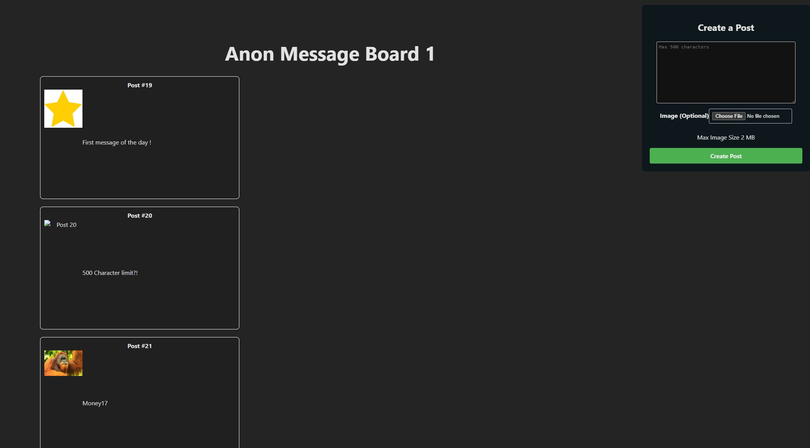

# Public Text and Picture Imageboard

This project showcases a fully functional React frontend, specifically designed to integrate seamlessly with a .NET API backend, providing a complete solution for building dynamic web applications.



## Create Post Component

Here is a snapshot of the Create Post component, which allows users to publish a post that includes both text and an image, providing an intuitive interface for content creation.

```js
    const handleSubmit = async (event: React.FormEvent) => {
        event.preventDefault();
        setLoading(true);
        setError(null);
        setSuccessMessage(null);

        // Create a new FormData object to send the form data
        const formData = new FormData();
        formData.append('text', text); //always has ext

        // Append the image to the form data if an image is selected
        if (image) {
            formData.append('image', image);
        }

        try {
            const response = await fetch('https://localhost:7163/Post/CreatePost', {
                method: 'POST',// http method
                body: formData, //data sent is body, object is caleld formdata
            });

            if (response.ok) {
                // If successful, show success message and reset form
                setSuccessMessage('Post created successfully!');
                setText(''); // Clear text input after successful post
                setImage(null); // Clear image selection
                window.location.reload()//refresh prage
            } else {
                // Handle non-200 responses
                const errorData = await response.json();
                setError(errorData.message || 'Failed to create post');
            }
        } catch (err) {
            // Log or display the error
            setError((err as Error).message);
        } finally {
            setLoading(false);
        }
    };
})
```

## Post List Component

This is a snapshot of the Post List component, which displays a collection of published posts. Each post contains both text and an image, which are showcased on the webpage for users to view.

```js
import React, { useEffect, useState } from 'react';

type PostType = {
    id: number;
    image: string | null;
    text: string;
};

const PostList: React.FC = () => {
    const [posts, setPosts] = useState<PostType[]>([]);
    const [loading, setLoading] = useState<boolean>(false);
    const [error, setError] = useState<string | null>(null);

    useEffect(() => {
        const fetchPosts = async () => {
            setLoading(true); // Start loading
            try {
                const response = await fetch('https://localhost:7163/Post/GetPost');
                if (!response.ok) {
                    throw new Error('Failed to fetch posts');
                }
                const data: PostType[] = await response.json(); // Array of posts
                setPosts(data);
            } catch (err) {
                setError((err as Error).message);
            } finally {
                setLoading(false); // End loading
            }
        };

        fetchPosts();
    }, []);

    if (loading) {
        return <div>Loading...</div>;
    }

    if (error) {
        return <div>Error: {error}</div>;
    }

    return (
        <div>
            {posts.map(post => (
                <div key={post.id} className="post-card">
                    <h2>Post #{post.id}</h2>
                    
                    <p>{post.text}</p>
                </div>
            ))}
        </div>
    );
};

export default PostList;
```
